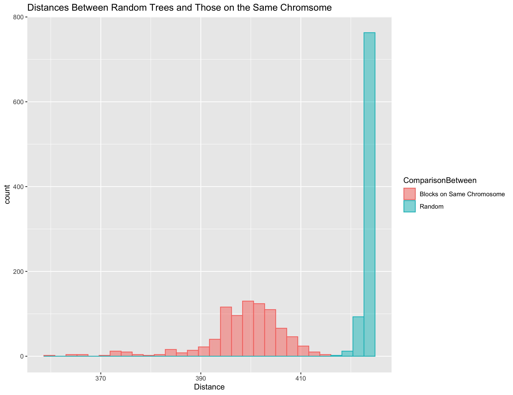

See [here](readme.md) for detailed information on the scripts run in each part.

## Task 1
TAIR10 Reference genome file sizes are as follows.
1. _chr1.fas: 29.4 MB
2. _chr2.fas: 19.0 MB
3. _chr3.fas: 22.7 MB
4. _chr4.fas: 17.9 MB
5. _chr5.fas: 26.1 MB
6. _chrC.fas: 153 kB
7. _chrM.fas: 363 kB

## Task 2
215 files were downloaded.

The minimum file size was 737104 bytes.

The maximum file size was 34726050 bytes.

The file quality_variant_Utrecht.txt could not be downloaded.

## Task 3

With 215 strains downloaded (i.e. 215 `quality_variant_<strain_name>.txt` files in the folder `data`), we ran `bash scripts/build_ind_genome.sh 1 997 1006`, and, in around 7 minutes, it produced `chr1_000997_to_001006.phy` in the folder `alignments`. The first line of the file is a header which gives the number of strains that were sequenced and the sequence length. Starting from the second line are each of the strains' sequences. The top of `chr1_000997_to_001006.phy` looks like this: 

    215 10
    Aa_0 ATTTGGTTAT
    Abd_0 AATTGGTTAT
    ...
    
followed by the 213 other strains' sequences.

## Task 4 

For tasks 4, we built a script that iteratively calls `build_ind_genome` in order to extract from a given chromosome non-overlapping, consecutive blocks of base pairs ("alignments") for each strain. 

We decided to analyze chromosome 1 for our project. We generated 30 blocks of length 100,000 base pairs. In order to avoid analyzing the telomeres, we start extracting at base pair 3 million and 1. That is, the first base pair of the first block is at position 3000001 in the chromosome.   

## Task 5

The program [IQ-TREE](http://www.iqtree.org) estimates genealogical trees based on DNA.

We modified the script for Task 4 so that it runs IQ-TREE on the alignment files it creates, thereby estimating a phylogenetic tree from each alignment.

Tasks 4 and 5 were run at once, split between the four of us. 

For 30 blocks of size 100000 on chromosome 1:

Blocks 1-8, run on Evan's mac, took 17 hours 14 minutes and 8 seconds in total.
Blocks 9-16, run on Sam's mac, took 9 hours 16 minutes 44 seconds total.
Blocks 17-23, run on Bodi's mac, took 12 hours 38 minutes 37 seconds total.
Blocks 24-30, run on Nathan's PC, took 2 days, 10 hours, 34 minutes and 46 seconds.

Nathan's PC appears to be unusually slow, so for the purposes of predicting total run time we will ignore it. The 23 blocks generated across Evan, Sam, and Bodi's macs took on average 102 minutes per block. Extrapolating this, to run for all blocks on all chromosomes would take about 2102 hours, 54 minutes (a little more than 87 days of total computation time.)

## Task 6

The program IQ-TREE was again used, this time to calculate the Robinson-Foulds distances between (a) all pairs of trees and (b) adjacent trees.

## Task 7

